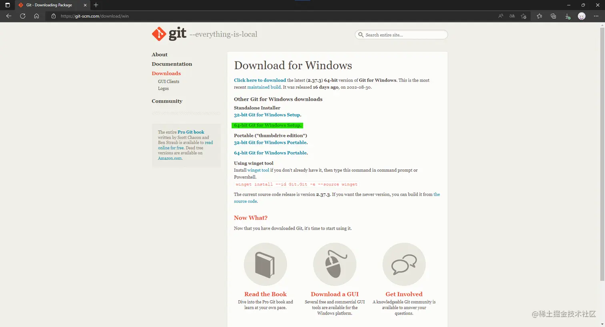
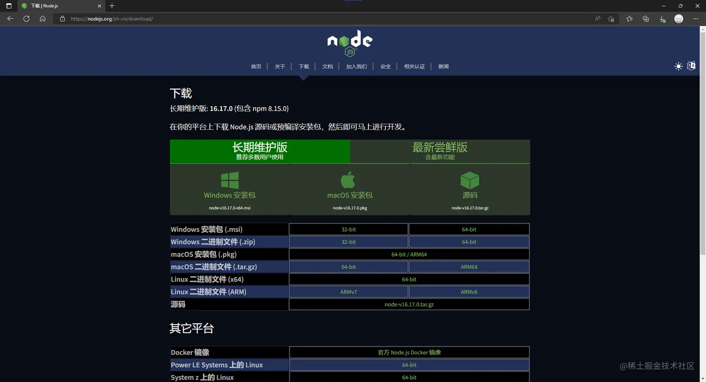
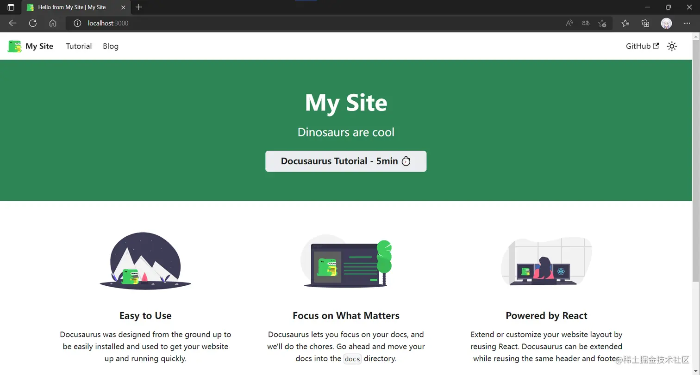
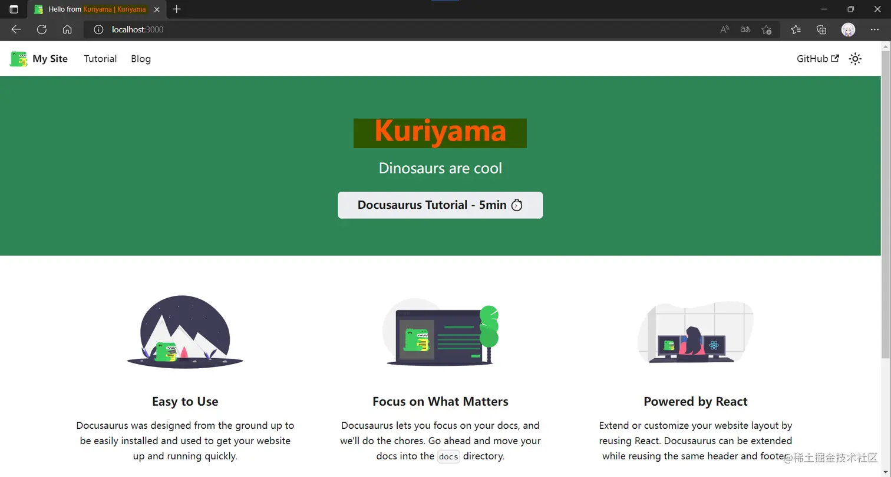
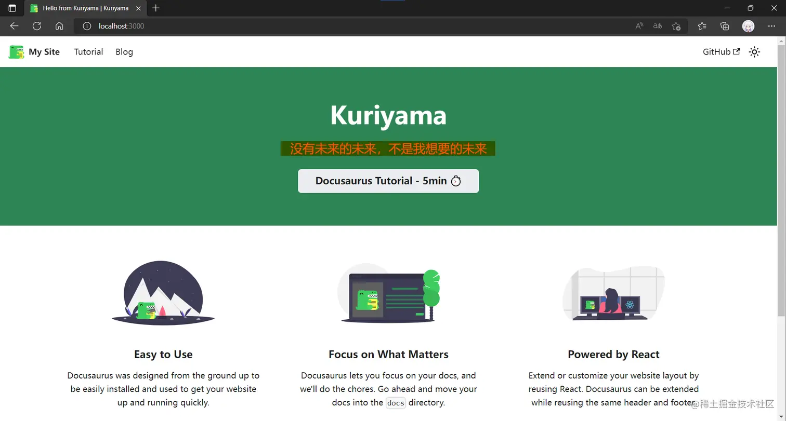
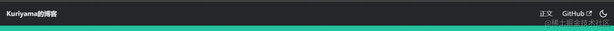
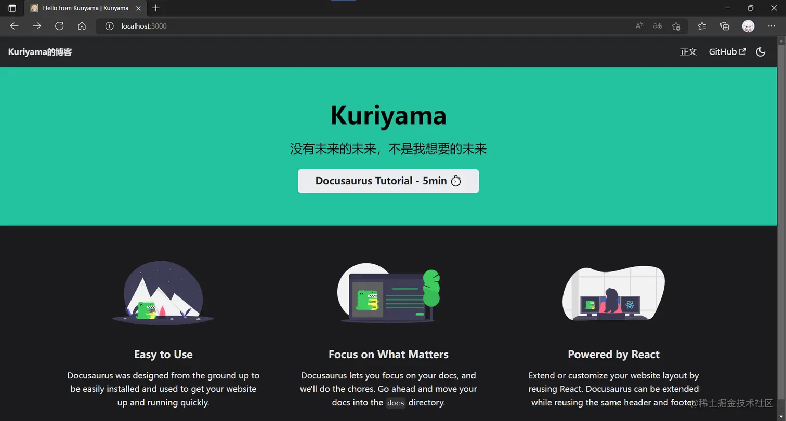
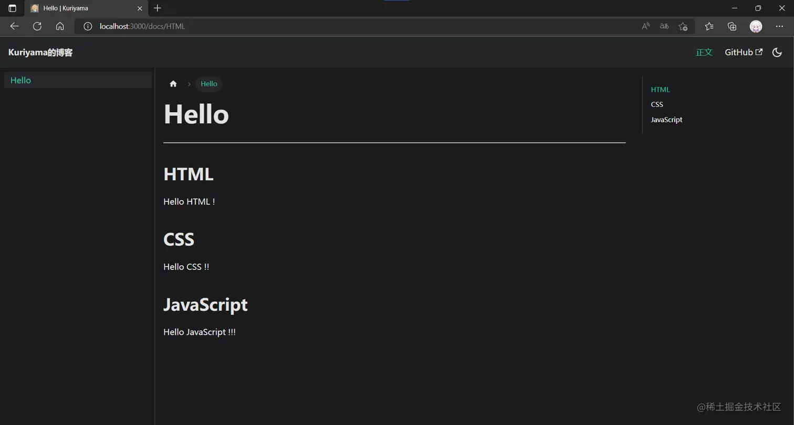
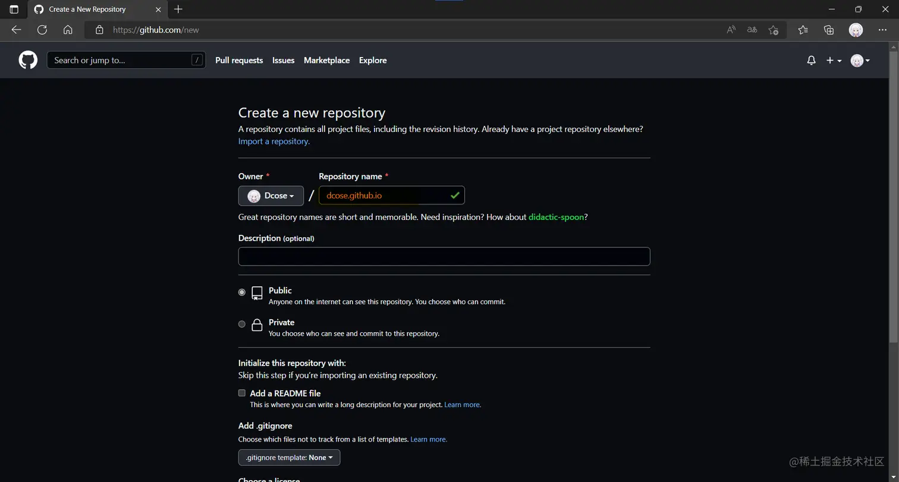
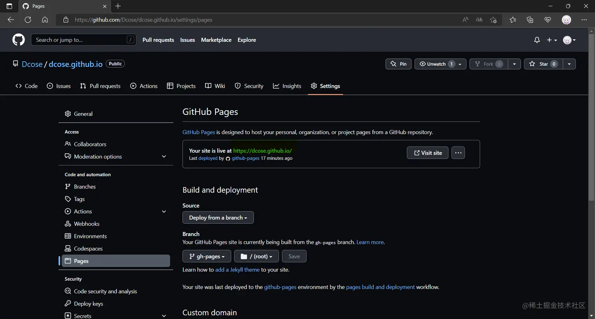

本文详细介绍了基于 Docusaurus + Github Pages 搭建博客的过程，包括环境准备（git 和 Node 下载）、安装脚手架、项目结构、配置（必填和可选字段）、个性化主题、部署（生成静态文件、配置相关文件、本地测试等），最后进行了总结。

关联问题: Docusaurus有何优势 Node版本如何选择 部署能换分支吗

## 前言

解决问题时经常看到大佬们的个人博客，于是一直想有一个属于自己的博客，为了满足自己的博客愿望，也为了督促自己要一直学习，小记一下（过程曲折）。暂时接触 React 稍多，而 `Docusaurus`是 React 驱动的，所以这里博客是基于`Docusaurus`+`Github Pages`来实现。

🔗 `Docusaurus`官网链接：[docusaurus.io/zh-CN/](https://link.juejin.cn/?target=https%3A%2F%2Fdocusaurus.io%2Fzh-CN%2F "https://docusaurus.io/zh-CN/")

## 一、 环境准备

### git

git 下载链接：[git-scm.com/downloads](https://link.juejin.cn/?target=https%3A%2F%2Fgit-scm.com%2Fdownloads "https://git-scm.com/downloads") 自己用的是 Windows 10，下载的是：[64-bit Git for Windows Setup](https://link.juejin.cn/?target=https%3A%2F%2Fgithub.com%2Fgit-for-windows%2Fgit%2Freleases%2Fdownload%2Fv2.37.3.windows.1%2FGit-2.37.3-64-bit.exe "https://github.com/git-for-windows/git/releases/download/v2.37.3.windows.1/Git-2.37.3-64-bit.exe")，其他设备按照对应机型选即可。 

### Node

Node 下载链接：[nodejs.org/zh-cn/](https://link.juejin.cn/?target=https%3A%2F%2Fnodejs.org%2Fzh-cn%2F "https://nodejs.org/zh-cn/") `Docusaurus`官方要求 Node.js -- v16.14 或以上版本（你可以运行`node -v`命令查看版本号），安装 Node.js 时，建议勾选所有和依赖相关的选项，其他设备按照对应机型选即可。 

## 二、安装脚手架

### 1\. 初始化新项目：

```shell
npm init docusaurus
```

控制台会提示输入项目名称、模板等信息，这里一直回车向后就可以，这些信息都是可以自己修改的。

### 2\. 项目结构

初始化完成后就会得到如下的项目结构（里面会有一些示例文件，后续删除即可），详细的[项目结构解读](https://link.juejin.cn/?target=https%3A%2F%2Fdocusaurus.io%2Fzh-CN%2Fdocs%2Finstallation%23project-structure-rundown "https://docusaurus.io/zh-CN/docs/installation#project-structure-rundown")：

```javascript
website ├── blog // 包含博客的 Markdown 文件 │ ├── ... │ └── ... ├── docs // 包含文档的 Markdown 文件 │ ├── ... │ └── ... ├── src // 如页面或自定义 React 组件一类的非文档文件 │ ├──components │ │ └── HomepageFeatures │ │ ├── styles.module.css │ │ └── index.jsindex.js │ ├── css // 页面的 css 样式 │ │ └── custom.css │ └── pages // 所有放在此目录中的 JSX/TSX/MDX 文件都会被转换成网站页面 │ ├── styles.module.css │ └── index.js ├── static // 静态目录，保存头像等文件 │ ├── img │ └── .nojekyll ├── babel.config.js // JavaScript 编译配置文件 ├── docusaurus.config.js // 站点配置文件！！ ├── package.json // 包管理文件 └── sidebars.js // 由文档使用，用于指定侧边栏中的文档顺序
```

### 3\. 运行开发服务器

```shell
# 进入根目录 cd website # 启动服务 npm run start
```

默认情况下，浏览器会自动打开 [http://localhost:3000](https://link.juejin.cn/?target=http%3A%2F%2Flocalhost%3A3000 "http://localhost:3000") 的新窗口，如下： 

## 三、 配置 ❗

`docusaurus.config.js` 位于你的网站的根目录，包含了你的站点的配置信息。

### 必填字段

👆 title：网站标题。 会用于页面元数据中，以及浏览器选项卡标题。

修改标题`title:'Kuriyama'`，可以看到： 

✌️ url：网站网址。 你可以把它看作是顶级主机名。

> 网站网址。 你可以把它看作是顶级主机名。 举个例子，[facebook.github.io/metro/](https://link.juejin.cn/?target=https%3A%2F%2Ffacebook.github.io%2Fmetro%2F "https://facebook.github.io/metro/") 的 URL 是`https://facebook.github.io`，而`https://docusaurus.io`的 URL 就是它本身。这个字段和`[baseUrl](https://docusaurus.io/zh-CN/docs/api/docusaurus-config#baseUrl)`字段相关。

👌 baseUrl：站点的 base URL。 可以被看作是主机名后的路径。

> 比如，[facebook.github.io/metro/](https://link.juejin.cn/?target=https%3A%2F%2Ffacebook.github.io%2Fmetro%2F "https://facebook.github.io/metro/") 的 base URL 是`/metro/`。 对于没有路径的网址，baseUrl 应设置为`/`。这个字段和`[url](https://docusaurus.io/zh-CN/docs/api/docusaurus-config#url)`字段相关。 开头和末尾始终要包含斜杠。

### 可选字段

#### 常用配置

-   tagline：网站标语。

修改标语`tagline:'没有未来的未来，不是我想要的未来'`，可以看到： 

-   onBrokenLinks：Docusaurus 在检测到无效链接时的行为。

`onBrokenLinks:'throw' // 抛出错误`

-   onBrokenMarkdownLinks：Docusaurus 在检测到无效 Markdown 链接时的行为。

`onBrokenMarkdownLinks:'warn' // 警告`

-   favicon：你的网站图标的路径；必须是可以用于链接 href 的 URL。 比如，如果你的图标位于 static/img/favicon.ico：

`favicon:'img/favicon.ico'`，可以看到： 

-   i18n：用于[本地化站点](https://link.juejin.cn/?target=https%3A%2F%2Fdocusaurus.io%2Fzh-CN%2Fdocs%2Fi18n%2Fintroduction "https://docusaurus.io/zh-CN/docs/i18n/introduction")的 i18n 配置对象。

```javascript
// 设置默认语言为中文简体 i18n: { defaultLocale: 'zh-Hans', locales: ['zh-Hans'], },
```

-   presets：预设，此处已经有了默认的\*\* classic \*\*预设：

```javascript
presets: [ [ 'classic', /** @type {import('@docusaurus/preset-classic').Options} */ ({ docs: { // 文档 sidebarPath: require.resolve('./sidebars.js'), // 侧边栏 // editUrl: '' // 编辑此页面的链接 }, blog: { // 博客 showReadingTime: true, // 在博文上显示估计阅读时间 // editUrl: '' // 编辑此页面的链接 }, theme: { // 主题 customCss: require.resolve('./src/css/custom.css'), // 自定义 css }, }), ], ],
```

#### 主题配置

**在配置导航栏之前我删除了 blog 和 docs 文件夹内的所有内容，并在 docs 文件夹内放了一个 HTML.md 文件。**

> navbar：导航栏，可以配置 title（标题）、logo（图标）等信息

```javascript
navbar: { title: 'Kuriyama的博客', // 标题 hideOnScroll: false, // 下拉界面时不隐藏导航栏 items: [ { type: 'search', // 搜索框 现在还没做好... position: 'right', // 搜索框位置 在右边 }, { type: 'doc', // 把这个项目的类型设置为文档链接。 docId: 'HTML', // 这个项目链接到的文档的 ID。 position: 'right', // 显示位置 在右边 label: '正文', // 项目显示的名称 }, { href: 'https://github.com/Dcose', // 点击图标时跳转到的链接 label: 'GitHub', // 项目显示的名称 position: 'right', // 显示位置 在右边 }, ], },
```

可以看到导航栏的改变： 

> prism：语法高亮主题

```javascript
prism: { theme: lightCodeTheme, // 用于浅色模式下代码块的 Prism 主题 darkTheme: darkCodeTheme, // 用于暗黑模式下代码块的 Prism 主题 defaultLanguage: 'javascript', // 项目应该出现在导航栏的哪一侧 },
```

> colorMode：主题色彩模式

```javascript
colorMode: { respectPrefersColorScheme: true, // 根据系统配色改变色彩模式 },
```

配置完成的 docusaurus.config.js（含默认配置）：

```javascript
const lightCodeTheme = require('prism-react-renderer/themes/github'); const darkCodeTheme = require('prism-react-renderer/themes/dracula'); /** @type {import('@docusaurus/types').Config} */ const config = { title: 'Kuriyama', tagline: '没有未来的未来，不是我想要的未来', url: 'https://your-docusaurus-test-site.com', baseUrl: '/', onBrokenLinks: 'throw', onBrokenMarkdownLinks: 'warn', favicon: 'img/favicon.ico', i18n: { defaultLocale: 'zh-Hans', locales: ['zh-Hans'], }, presets: [ [ 'classic', /** @type {import('@docusaurus/preset-classic').Options} */ ({ docs: { sidebarPath: require.resolve('./sidebars.js'), }, blog: { showReadingTime: true, }, theme: { customCss: require.resolve('./src/css/custom.css'), }, }), ], ], themeConfig: /** @type {import('@docusaurus/preset-classic').ThemeConfig} */ ({ navbar: { title: 'Kuriyama的博客', hideOnScroll: false, items: [ { type: 'search', position: 'right', }, { type: 'doc', docId: 'HTML', position: 'right', label: '正文', }, { href: 'https://github.com/Dcose', label: 'GitHub', position: 'right', }, ], }, prism: { theme: lightCodeTheme, darkTheme: darkCodeTheme, defaultLanguage: 'javascript', }, colorMode: { respectPrefersColorScheme: true, }, }), }; module.exports = config;
```

效果如下：  

#### 个性化

> 💯 使用的是[**Akara**](https://link.juejin.cn/?target=https%3A%2F%2Fmessiahhh.github.io%2Fblog%2F "https://messiahhh.github.io/blog/")大佬的主题。

## 四、 部署 ❗❗

1.  生成静态文件：

```shell
npm run build
```

> Docusaurus 只负责构建站点，然后把静态文件输出到 build 文件夹。

2.  配置`docusaurus.config.js`：

```javascript
... const config = { url: 'https://dcose.github.io', baseUrl: '/', ... organizationName: 'Dcose', // 一般是 github 的名字 projectName: 'dcose', // 一般是仓库的名称 deploymentBranch: 'gh-pages', // 要把静态文件部署到的分支名称 ... }; module.exports = config;
```

3.  配置`package.json`：

```javascript
{ "name": "dcose", // 项目名称 ... "scripts": { ... "deploy": "GIT_USER=dcose docusaurus deploy", // 部署用户名设置 ... }, ... }
```

4.  本地测试

可以快速定位部署项目可能存在的问题：

```shell
npm run serve
```

5.  在 github 新建一个仓库

名字：dcose.github.io 

6.  在项目的根目录下新建一个`deploy.sh`脚本文件，注意修改对应的用户名和仓库名：

```shell
#!/usr/bin/env sh # 确保脚本抛出遇到的错误 set -e # 生成静态文件 npm run build # 进入生成的文件夹 cd build # 如果是发布到自定义域名 # echo 'www.example.com' > CNAME git init git add -A git commit -m 'deploy' # 如果发布到 https://<USERNAME>.github.io # git push -f git@github.com:messiahhh/messiahhh.github.io.git master # 如果发布到 https://<USERNAME>.github.io/<REPO> # git push -f git@github.com:messiahhh/blog.git master:gh-pages git push -f https://${access_token}@github.com/Dcose/dcose.github.io.git master:gh-pages cd -
```

5.  切换到项目的根目录，运行`deploy.sh`脚本文件

注意：执行文件会启动 Git Bash，等待执行完成就好

6.  打开 github 仓库，可以看到 gh-pages 推送的静态文件了：


7.  点击 setting，找到 Pages，就可以看到我们生成的[博客地址](https://link.juejin.cn/?target=https%3A%2F%2Fdcose.github.io%2F "https://dcose.github.io/")：

 完成部署！！！

## 五、 总结

关于博客的搭建和部署就暂告一段啦，虽然还有很多功能和插件都没有用到，希望可以在日后的学习中逐渐补全。这算是对于产出的第一次尝试，看了 [mqyqingfeng](https://link.juejin.cn/?target=https%3A%2F%2Fgithub.com%2Fmqyqingfeng%2FBlog "https://github.com/mqyqingfeng/Blog") 和 [sudongyuer](https://link.juejin.cn/?target=https%3A%2F%2Fsudongyuer.github.io%2Fblogs%2Fdaily%2F070602.html%23%25E4%25B8%2580%25E3%2580%2581%25E5%2587%2586%25E5%25A4%2587%25E5%25B7%25A5%25E4%25BD%259C "https://sudongyuer.github.io/blogs/daily/070602.html#%E4%B8%80%E3%80%81%E5%87%86%E5%A4%87%E5%B7%A5%E4%BD%9C") 两位大佬的文章有感而发，想自己也可以有一些学习的记录，同时感谢 [Akara](https://link.juejin.cn/?target=https%3A%2F%2Fmessiahhh.github.io%2Fblog%2F "https://messiahhh.github.io/blog/") 大佬的开源主题。本文旨在分享，也希望可以帮助到有需要的人，如有存在错误或不妥的地方，请各位大佬务必帮我指正！！感谢大家！！！希望大家可以一起**无限学习，无限进步！！！！**
